# Previsão de Temperatura Horária com Machine Learning

Este projeto é um pipeline completo de Ciência de Dados construído no **KNIME Analytics Platform**. O objetivo é prever a temperatura horária do ar (Bulbo Seco) com altíssima precisão, utilizando dados climáticos históricos e técnicas de Machine Learning.

## Arquitetura do Workflow

Abaixo está a representação visual de todo o fluxo de dados, desde a extração automatizada até a avaliação visual do modelo:

## Etapas do Pipeline

O projeto foi estruturado com foco em boas práticas de engenharia de dados e validação científica, dividido em três grandes etapas:

### 1. Extração e Integração (ETL)
- Automação via requisições HTTP (`GET Request`) para download de bases de dados.
- Descompactação automática de arquivos e leitura consolidada (`CSV Reader`).

### 2. Limpeza e Engenharia de Features
- **Filtro de Qualidade:** Remoção rigorosa de linhas com valores nulos (`Missing Value`) para garantir a integridade matemática do modelo.
- **Features Temporais:** Extração inteligente de partes da data e hora (`Date&Time Part Extractor`).
- **Série Temporal (Lag):** Implementação de uma coluna de *Lag*, utilizando a temperatura da hora anterior como variável preditora, simulando a inércia térmica do mundo real.

### 3. Modelagem e Validação (Machine Learning)
- **Data Splitting:** Estratégia robusta de divisão de dados garantindo que o modelo seja testado no "mundo real":
  - **Treino:** 65%
  - **Validação:** 15%
  - **Teste (Holdout Cego):** 20%
- **Algoritmo:** Regressão Linear (`Linear Regression Learner`).
- **Avaliação Visual:** Uso do `Line Plot` para comparar de forma interativa e visual as predições do modelo contra a temperatura real ao longo do tempo.
- **Comparação de Métricas:** Utilização do `Concatenate` para alinhar lado a lado as notas de Validação e de Teste Cego.

## Resultados do Modelo

O uso da variável temporal de inércia (Lag) em conjunto com a Regressão Linear resultou em um desempenho excepcional na previsão do clima:

* **Coeficiente de Determinação (R²):** 0.993 (O modelo explica mais de 99% da variância térmica).
* **Erro Médio Absoluto (MAE):** 0.269 (A Inteligência Artificial tem uma margem de erro média de apenas ~0.27 graus Celsius por previsão).

## Tecnologias Utilizadas
* **Ferramenta:** KNIME Analytics Platform.
* **Técnicas:** ETL, Data Cleaning, Feature Engineering, Séries Temporais, Holdout Validation, Linear Regression.
